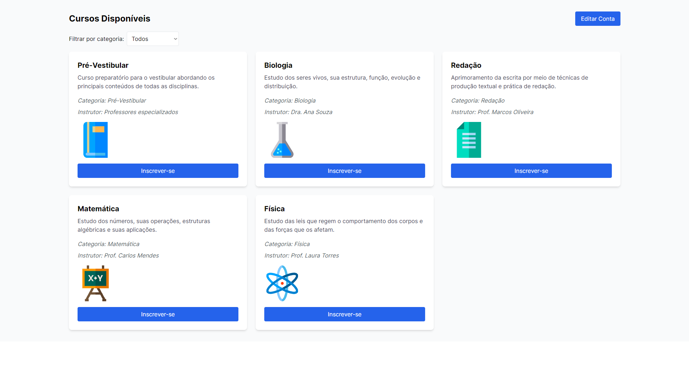

<p align="center">
   
</p>

<p align="center">	
   <a href="https://www.linkedin.com/in/gustavo-gk/">
      
   </a>
  
  
  <a href="mailto:gust.krv@gmail.com">
   
  </a>
</p>

<p align="center">
  👏  Projeto desafio frontend - Grupo Pensar Educação
</p>

<div align="center">
  <sub> Made with 💖 by
    <a href="https://github.com/gustavogk"> Gustavo Assunção.
    <h1></h1>
  </sub>
</div>
  
# 📌 Contents

* [Technologies](#rocket-technologies) 
* [Screenshots](#camera-screenshots) 
  
# :rocket: Technologies
This project was made using the follow technologies:

* [React](https://reactjs.org/)      
* [NextJS](https://nextjs.org/)
  
# :camera: Screenshots
  
<div align="center">
   
   
   
   
</div>

# :computer: How to run
  
```bash
# Clone Repository
$ git clone https://github.com/gustavogk/frontend-challenge
```

```bash
# Install
$ npm install

# Run Aplication
$ npm run dev
```

# :bug: Issues

Create a <a href="https://github.com/gustavogk/async-repo-cloner/issues">new issue report</a>, it will be an honor to be able to help you solve and further improve our application.

# :sparkles: Contributing

- Fork this repository;
- Create a branch with your feature: `git checkout -b my-feature`;
- Commit your changes: `git commit -m 'feat: My new feature'`;
- Push to your branch: `git push origin my-feature`.
  
# :page_facing_up: License

Made with 💖 by [Gustavo Assunção](https://www.linkedin.com/in/gustavo-gk/). 

Thank you! 🌠
